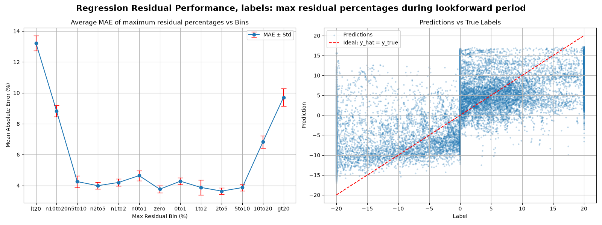

# WARA SEBx TS Challenge
This repository contains an example base model for predicting the maximum relative structural deviation (the “Max Deviation %”) of an asset’s price from its 95% statistical confidence interval (CI) over a lookforward horizon.

Participants in the challenge are expected to provide trained model checkpoints in the repository structure used by the training pipeline so that the evaluation script `experiments/linear_trend/test_regression_residual_ensemble.py` can load them, aggregate the ensemble predictions, and reproduce the reported out-of-sample validation metrics.

## Example model output

The chart below shows the performance of the daily regression base model $\mathcal{M}_{\mathrm{base}}$ for US stocks using a 252-day training window and a 21-day lookforward horizon. Note that this model is only trained using the price information and does not benefit from the auxiliary context $\mathcal{A}_i(t)$, therefore, we have:

$$\hat{Y}^{\mathrm{base}}_i = \mathcal{M}_{\mathrm{base}}(X_i).$$

This figure has two panels:

- Left panel: average MAE by residual bin. The x-axis shows the maximum residual percentage bins, from strongly negative residuals on the left to strongly positive residuals on the right. The blue line is the mean absolute error (MAE) in each bin, and the red error bars show the standard deviation. This helps visualize where the model is most accurate and where errors are largest.
- Right panel: predictions vs. true labels. Each blue point compares the model prediction against the actual label for a sample. The dashed red line is the ideal identity line where prediction equals truth. Points clustered near this line indicate the model is capturing the target reasonably well, while scatter away from the line reflects residual error.

Together, the chart indicates how well the trained model predicts the maximum residual percentage over the future window and where its predictive accuracy breaks down across the distribution of outcomes.

### Base Model performance summary

From the 10 Monte Carlo ensemble runs, the model achieved the following validation performance:

| Metric | Value |
| --- | ---: |
| MSE list | [53.9, 52.8, 51.6, 51.2, 55.3, 52.0, 55.2, 57.5, 46.3, 51.2] |
| **Average MSE** | **52.7021 ± 2.8967** |
| Mean MAE by bin | [13.2, 8.8, 4.3, 4.0, 4.2, 4.6, 3.8, 4.3, 3.9, 3.6, 3.9, 6.8, 9.7] |
| Std MAE by bin | [0.5, 0.4, 0.4, 0.2, 0.2, 0.3, 0.2, 0.2, 0.5, 0.2, 0.2, 0.4, 0.6] |
| **Average MAE across all labels** | **5.8 ± 0.1** |

This corresponds to an ensemble-average residual-regression performance of roughly **52.7 MSE** and **5.8 MAE** on the validation set, with moderate variation across ensemble runs.

## Available datasets

The two primary datasets are available:

1. **Core Stock Universe Dataset** — `data-20250901.zip`
   - A comprehensive dataset consisting of daily OHLCV historical asset data for US equities, spanning from `1991-01-01` to `2020-12-31`.

2. **Auxiliary Regime Variates Dataset** — `SEB Auxiliary Regime Dataset.xlsx`
   - A heterogeneous macroeconomic and cross-asset dataset, curated to assist in market regime classification and macro signal extraction. 

These two sources are intended to be used together: the stock universe dataset provides the core market/instrument data, while the auxiliary regime dataset adds contextual regime features for the broader modeling setup. The above performance is achieved using only the Core Stock Universe Dataset.

# Instructions
Make sure Git LFS is installed:

`git lfs install`

Now clone the repo:

`git clone https://github.com/banque-nouveau/WARA_SEBx_TS_Challenge.git`

The datasets will be downloaded automatically. Make sure to extract the zip file: 

`cd WARA_SEBx_TS_Challenge`

`unzip Data/data-20250901.zip -d Data/`

Use `pyproject.toml` file to install the dependencies inside your virtual env. You need to run:

`pip install -e .